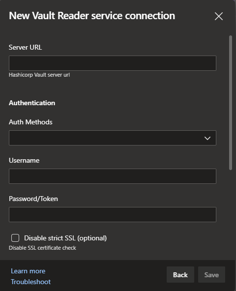
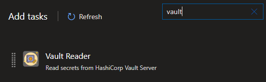
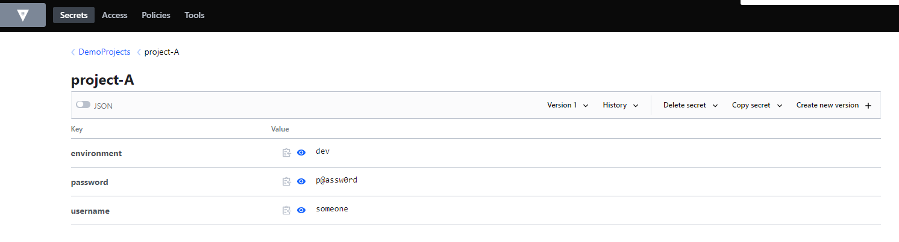
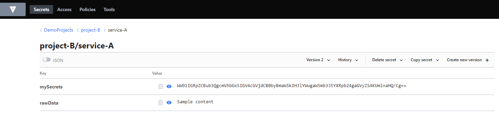
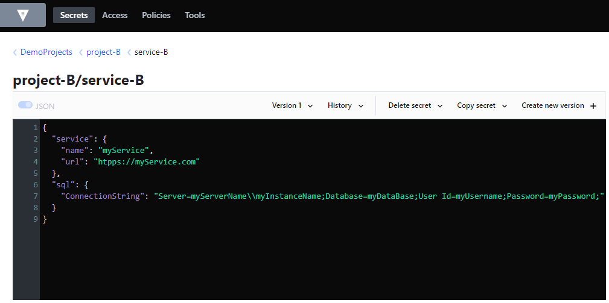

# vault-reader - Version 2.*
The purpose of this task is to read secrets from HashiCorp Vault server in order to use it during the build or the release process.


 <br>
>_The icon was taken from https://icons8.com/_


## Task Configuration

How to create a service connection:
* Open Azure DevOps and select the relevant project.
* go to project settings.
* Select service connections under Pipelines section.
* Create a new service by clicking on the "New service connection" button.
* Select "Vault Reader" type and press Next.


* Fill all details:
   * Server URL - the URL of the HashiCorp server. i.e. https://myvault.com:8200
   * Auth Methods - select the method from the list. i.e. LDAP, Token etc.
   * Username - enter username.
   * Password/Token - enter password or token for that user.
   * Disable strict SSL - select this option if you get the error: <span style="color:red"> unable to verify the first certificate.</span>

* Enter service name and description, and click Save.

---

## How to work with the task during a build/release process

Open build/release and add the task from the list.



**<ins>Fields:</ins>**
* Vault Service - select the Vault Connection Service from the list.
* Source Type:
   * Inline - define instructions (Variables & Actions) in multiline box.
   * File Path - read the instructions from file (there is also multiline box to define variables).

**<ins>Instructions:</ins>**<br>

The signs <span style="color:yellow">=></span> or <span style="color:yellow"><=</span> are part of the task instructions.

<ins>General Instructions:</ins><br>
* Comment - add a comment to your instruction by using <span style="color:yellow">#</span> at the beginning of the line. the task will ignore that line.
* Message - print a message during the Build/Release process by using <span style="color:yellow">@</span> at the beginning of the line.


<ins>Variables:</ins><br>
You can define a variable and use it later with the Action commands.<br>
> Format: <span style="color:orange">Variable-Name</span> <= <span style="color:green">Value</span>

```
Example:
projectPath <= /project/serviceA
```
In this example we will create a variable named <span style="color:orange">projectPath</span> that sets the value <span style="color:green">/project/serviceA</span><br>

<ins>Define Actions:</ins><br>
> General Format:
<span style="color:lime">ActionType</span> => 
<span style="color:lightpink">Path</span> =>
<span style="color:lightgreen">Field</span> =>
<span style="color:aqua">Azure-DevOps-Variable</span><br>

_Variables affect the <span style="color:lightpink">Path</span> and <span style="color:lightgreen">Field</span> of the action_

| Action | Description | Azure DevOps Variable [^1] |
|--------|-------------|-----------------------|
| var | reads value from <span style="color:lightpink">Path</span> & <span style="color:lightgreen">Field</span> | assigns value to Azure DevOps variable [^2] |
| pre | reads object from <span style="color:lightpink">Path</span><br> <span style="color:lightgreen">Field</span> will contain a list of keys (separated by a comma) or * for all keys (not recommended) | assigns multiple values to multiple variables<br> in a single command [^2] [^3] |
| raw | reads value from <span style="color:lightpink">Path</span> & <span style="color:lightgreen">Field</span> and store the value into a file (as is) | assigns file location into a variable [^4] [^5] |
| base64 | reads value from <span style="color:lightpink">Path</span> & <span style="color:lightgreen">Field</span>, decodes the value from BASE64 and stores the result into a file | assigns file location into a variable [^4] [^5] |
| json | reads json object from <span style="color:lightpink">Path</span> and stores it into a file as json<br> <span style="color:lightgreen">Field</span> will contain location of the file schema. If the data and the scheme aren't equal it would fail<br> use * to skip the compare process (not recommended) | assigns file location into a variable [^5] |
| rep | reads file from <span style="color:lightgreen">Field</span> and replaces the string \__[key]__ with a value that reads from <span style="color:lightpink">Path</span> and stores it into a file | assigns file location into a variable [^5] |

<br>

[^1]: Azure DevOps Variable - the result of the action will be stored at the variable and can be used in the next tasks as <span style="color:green">$(variableName)</span> <br>
[^2]: The type of the variable is "secret" and therefore it can't be printed in the build & release console.<br>
[^3]: Variable name: <span style="color:aqua">Azure-DevOps-Variable</span><span style="color:red">_</span><span style="color:lightgreen">Field</span><br>
[^4]: On Linux OS set permissions to Read only.<br>
[^5]: The file that contains the secrets will be deleted at the end of the build/release process (the file is stored under _temp folder).

<br>

## Examples:

### How to use <span style="color:yellow">var</span> and <span style="color:yellow">pre</span> actions




Read values from project-A using <span style="color:yellow">var</span> action
```
# This line is a comment.
# Read environment value from vault into env variable 
var => DemoProjects/project-A => environment => env

# Read username & password from vault into usr & pass variables
var => DemoProjects/project-A => username => usr
var => DemoProjects/project-A => password => pss
```

Read username & password in one line using <span style="color:yellow">pre</span> action and store them in login_username & login_password.
```
# Read username & password with pre action
pre => DemoProjects/project-A => username,password => login
```

### How to use <span style="color:yellow">raw</span> and <span style="color:yellow">base64</span> actions



Read value and save it into a file. The variable will be set with the file location.

```
@ This line will be printed on the build/release console
@ Read rawData and save it into a file. File path will be stored at variable $(file1)
raw =>  DemoProjects/project-B/service-A => rawData => file1

# Read mySecret from vault, decode it (base64) and save it into a file.
# The location will be stored at the variable secret.
base64 =>  DemoProjects/project-B/service-A => mySecret => secret
```

### How to work with VaultReader variables

This section refers to the previous image.
```
# Define a variable that named servicePath
servicePath <= DemoProjects/project-B/service-A

# Read value using a variable
raw => {servicePath} => rawData => file1
base64 => {servicePath} => mySecret => secret
```
_You can also use a variable as a part of Path/Field._<br>
_For example: {servicePath}/test (equal to DemoProjects/project-B/service-A/test)_

### How to use <span style="color:yellow">json</span> action



We can create a json file that contains a template (value will be empty). This way we can compare the scheme between the objects from the vault server and the json file. The json file can be stored on the source control and will be pulled during the build.

_File: service-b-template.json_ <br>
_The json file will be stored under <span style="color:gray">config</span> folder in the git repository._
```
{
  "service": {
    "name": "",
    "url": ""
  },
  "sql": {
    "ConnectionString": ""
  }
}
```

```
# Define a path
servicePath <= DemoProjects/project-B

# Read value using json action
json => {servicePath}/service-B => config/service-b-template.json => configFile
```

### How to use <span style="color:yellow">rep</span>lace action


When we have a file that we want to inject secrets during the build/release process to it.
For example, a secret.yaml file on the working directory that defines Secret for k8s cluster:
```
apiVersion: v1
kind: Secret
metadata:
  name: secret-basic-auth
type: kubernetes.io/basic-auth
stringData:
  username: __username__
  password: __password__
```

On the task instructions:

```
# Inject secrets into a yaml file
rep => DemoProjects/project-A => secret.yaml => secretFile
```
The variable $(secretFile) will contain the location of the updated file.<br>
 To update kubernetes cluster you can run the following command:
>kubectl apply -f $(secretFile)

<br>
---